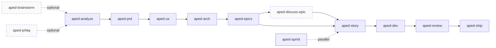
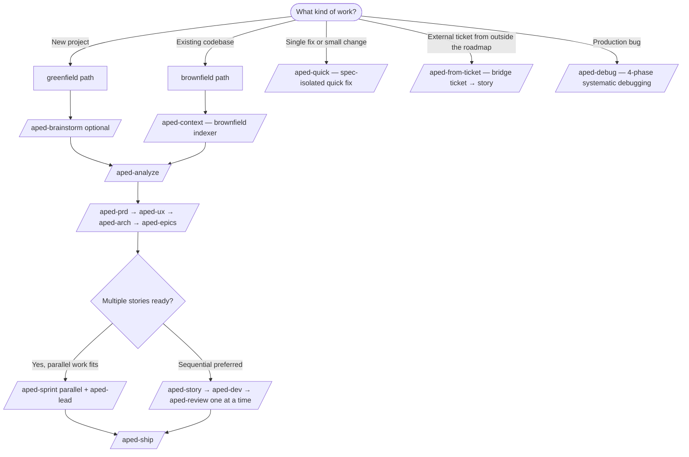
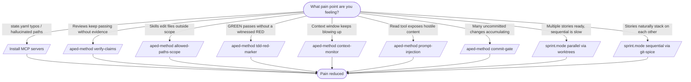

# APED Method

[](https://www.npmjs.com/package/aped-method)
[](https://www.npmjs.com/package/aped-method)
[](https://nodejs.org)
[](./LICENSE)

**Turn Claude Code into a disciplined dev pipeline.** APED scaffolds 36 skills, two hooks, named agent personas, and parallel-sprint mode (via `git worktree` + Lead Dev coordinator) into any [Claude Code](https://claude.ai/download) project. Every phase produces an artefact, requires explicit user validation, and hands off through a coherence hook that warns on skipped steps.

Cross-tool ready: skills are symlinked to `.opencode/`, `.agents/`, and `.codex/` when those marker directories exist — one source of truth, every IDE sees the same scaffold.

> Upgrading? See [MIGRATING.md](./MIGRATING.md) for 5.x → 6.x and 3.x → 4.x paths.

```
npx aped-method
```

```
     █████╗ ██████╗ ███████╗██████╗
    ██╔══██╗██╔══██╗██╔════╝██╔══██╗
    ███████║██████╔╝█████╗  ██║  ██║
    ██╔══██║██╔═══╝ ██╔══╝  ██║  ██║
    ██║  ██║██║     ███████╗██████╔╝
    ╚═╝  ╚═╝╚═╝     ╚══════╝╚═════╝
          M  E  T  H  O  D

    Analyze → PRD → UX → Arch → Epics → Story → Dev → Review
```

## The pipeline at a glance



Eight phases, all opt-in upstream. Sprint mode (parallel via `git worktree` + Lead Dev coordinator) wraps Story → Dev → Review when an epic has multiple ready-to-go stories. `aped-discuss-epic` is the 6.9.0 epic-level decision-lock between Epics and Story.

## Requirements

| Tool | Status | What breaks without it |
|---|---|---|
| [Claude Code](https://claude.ai/download) | required | Everything. APED scaffolds *into* a Claude Code project. |
| Node.js ≥ 20 | required | The CLI itself + the markdown-schema walker. |
| bash + Unix-like shell (macOS / Linux / WSL) | required | Helpers (`*.sh`) use POSIX `stat`, `mkdir`-locking, `tmux` — native Windows is not supported. |
| `yq` (v4) | hard for some paths | `migrate-state.sh`, `sync-state.sh mark-story-done`, `append-correction` refuse without it. Other state ops fall back to awk. |
| `jq` | soft | Faster guardrail JSON encoding + audit log writer. Falls back to `node -e`. |
| `gh` | soft | GitHub PR creation, `aped-ship` workflow when `git_provider: github`. |
| [`workmux`](https://github.com/raine/workmux) | opt-in | Parallel-sprint dispatch via tmux. APED falls back to manual instructions. |

Run `aped-method doctor` after install — non-blocking warnings tell you exactly which feature is degraded by each absent binary.

## Quick start

```bash
cd your-project
npx aped-method
```

Interactive prompts (powered by [@clack/prompts](https://github.com/bombshell-dev/clack)) ask for project name, author, languages, ticket system, and git provider. Or go non-interactive:

```bash
npx aped-method --yes \
  --project=my-app --author=Jane \
  --lang=french --tickets=linear --git=github
```

Then open Claude Code:

```
aped-brainstorm   # (Optional) Diverge first — 100+ ideas before converging
aped-prfaq        # (Optional) Working Backwards — press-release-first discipline
aped-analyze      # Start with guided discovery
```

### Optional: parallel sprints

Once you reach the sprint phase (after `aped-epics`), you can run several stories in parallel via `git worktree`:

```
aped-sprint     # DAG resolver + capacity check + dispatch
```

For the best experience, install [workmux](https://github.com/raine/workmux) (`brew install raine/workmux/workmux`) — APED detects it and will auto-create a tmux window with Claude Code pre-launched per story. Without workmux, `aped-sprint` prints the exact `cd` + `claude` + `aped-dev` commands to run in new terminals.

**Two sprint modes since 6.7.5.** `sprint.mode: parallel` (default) is the workmux flow above. `sprint.mode: sequential` (opt-in, requires [git-spice](https://github.com/abhinav/git-spice)) creates ONE shared worktree and stacks stories on top of each other — `gs branch checkout` switches the active story in place. Lighter on disk + `node_modules` install, ideal when stories naturally depend on each other. `sprint-dispatch.sh` HALTs at sprint start if `gs --version` doesn't surface a git-spice signature.

### Maintenance & optional add-ons

```bash
aped-method doctor                # verify an installed scaffold
aped-method statusline            # install the APED status line
aped-method safe-bash             # install the optional Bash safety hook
aped-method symlink               # repair APED skill symlinks
aped-method post-edit-typescript  # install the optional TS quality hook
aped-method verify-claims         # install the verification-gate advisory hook
aped-method worktree-scope        # install the worktree-scope advisory hook
aped-method tdd-red-marker        # install the TDD RED-witness advisory hook
aped-method enable-mcp            # install aped-state MCP server (typed state.yaml ops)
aped-method session-start         # install the SessionStart skill-index hook
aped-method visual-companion      # install the brainstorm browser companion
aped-method sync-logs prune       # one-shot retention sweep (4.1.0+; default
                                  # dry-run, --apply to delete, --provider=NAME
                                  # to scope; opt-in via sync_logs.retention)
aped-method disable               # suppress all APED skills from natural-
                                  # language routing (6.2.0+, reversible)
aped-method enable                # restore APED skill routing
aped-method status                # report enabled/disabled + last toggle
```

Each opt-in subcommand also accepts `--uninstall` to remove its installed bits.

## Skill catalog

APED ships **36 skills** as directories under `src/templates/skills/aped-*/`. Invoke them by name via Claude Code's Skill tool, or — recommended — let the runtime route automatically by using a phrase that matches the skill's `description:` (e.g. "create the prd", "run an architecture review", "kick off dev").

Each skill is a directory: `SKILL.md` (entry), optional `workflow.md` (phases), optional `steps/step-NN-*.md` (micro-steps). The 10 phase skills (`aped-analyze`, `aped-prd`, `aped-ux`, `aped-arch`, `aped-epics`, `aped-story`, `aped-dev`, `aped-review`, `aped-debug`, `aped-brainstorm`) are fully decomposed into 6–12 steps each; the other 26 are inline `SKILL.md` (optionally with `workflow.md`).

Why decompose: Claude only loads the slice relevant to the current step instead of paging through a 600-line monolith. Same thesis as Anthropic's [code-execution-with-MCP](https://www.anthropic.com/engineering/code-execution-with-mcp) (progressive disclosure of typed tools).

For the full taxonomy (small / medium / phase-decomposed, opt-in defaults, hard vs soft dependencies), see [docs/skills-classification.md](./docs/skills-classification.md). For ADR sharding, domain glossary, doc hygiene, and the schema-based artefact contracts (cohort-1 since 6.3.0, cohort-2 since 6.9.0, cohort-3 PRD since 6.10.0, cohort-3b architecture since 6.11.0 — 5/5 coverage closed), see [docs/aped-workflow.md](./docs/aped-workflow.md).

## Operational commands

Beyond `npx aped-method` (install / update / fresh), the CLI ships a handful of maintenance subcommands:

- `aped-method doctor` — verify scaffold, hooks, state, skills, symlinks, optional binaries.
- `aped-method symlink` — repair cross-tool skill symlinks (`.claude/skills/`, `.opencode/skills/`, `.agents/skills/`, `.codex/skills/`).
- `aped-method disable` / `enable` / `status` — kill-switch APED routing in a project (6.2.0+). See [Disable APED in a project](#disable-aped-in-a-project-620) below for the full mechanics.

Optional hooks and the MCP companion server each ship as their own subcommand — see the [Optional hooks](#optional-hooks) table below.

### Disable APED in a project (6.2.0+)

Reversible kill-switch — flip APED's natural-language routing off without uninstalling:

```bash
npx aped-method disable                # team-wide (commits SKILL.md frontmatter flips + snapshot)
npx aped-method disable --local        # per-developer (gitignored marker + config.local.yaml; nothing to commit)
npx aped-method status                 # report enabled / disabled / disabled-local + last toggle
npx aped-method enable                 # restore — consumes snapshot or removes the local marker
```

**How it works.** Disable flips `disable-model-invocation: true` on every `.aped/aped-*/SKILL.md` and writes `.aped/.DISABLED`. A `check-enabled.sh` activation guard runs at every skill body's start — even an explicit `/aped-X` invocation HALTs silently when APED is off. Local mode skips the frontmatter flips entirely and uses a gitignored `config.local.yaml` with precedence over the team config.

## Personas & teams

APED runs work through **named agent personas** so each agent stays in character. Five distinct teams across the pipeline:

- **Research** (`aped-analyze`) — **Mary** (Market), **Derek** (Domain), **Tom** (Staff Eng). Parallel, independent.
- **Review** (`aped-review`, slim since 6.2.0) — **Spec auditor** + **Code auditor** + **Edge & hallucination auditor** (always-on) + **Aria** (visual, frontend conditional). One parallel `Agent` dispatch; no LLM judgement on the auto-path.
- **Fullstack dev** (`aped-dev` optional mode, ≥2 layers) — **Kenji** (API contract), **Amelia** (backend), **Leo** (frontend). Contract-first via `SendMessage`.
- **Architecture Council** (`aped-arch` for hard-to-reverse decisions) — **Winston** (always) + **Lena** (pragmatic) + **Raj** (security/compliance) + **Nina** (cost/ops) + **Maya** (edge cases). Independent verdicts, user picks final.
- **Retrospective** (`aped-retro`) — **Mia** (struggle), **Leo** (velocity/quality), **Ava** (previous-retro auditor).

Tool surface: `Agent` for all specialist dispatches, `TaskCreate`/`TaskUpdate`/`TaskList` for sprint tracking, `TeamCreate`/`SendMessage` only in `aped-dev` fullstack mode (Kenji/Amelia/Leo co-edit a shared contract).

For the full persona catalogue including the 11-specialist Stage-1.5 reviewers (Hannah/Eli/Aaron) folded into the slim model, see [docs/aped-personas.md](./docs/aped-personas.md).

## Where to use what

**Coming from an existing codebase?** Start with **`aped-context`** — the brownfield entry-point. It walks the repo, generates `project-context.md`, and sets the `brownfield`/`greenfield`/`hybrid` verdict that every downstream APED skill discovers and adapts to. Then `aped-analyze` (or skip straight to `aped-prd` if the discovery already answered the strategy questions). For a true greenfield (empty directory), start with `aped-brainstorm` or `aped-analyze`.



A short cheat sheet for the most common decisions:

| Situation | Run | Why |
|---|---|---|
| Joining an existing codebase | `aped-context` first, then `aped-analyze` (hybrid mode) | Brownfield entry-point — sniff `type` (brownfield/greenfield/hybrid), load conventions, then plan. |
| Bootstrapping a new product | `aped-brainstorm` → `aped-analyze` | Diverge then converge before locking the PRD. |
| Epic has cross-cutting decisions | `aped-discuss-epic <N>` between Epics and Story | SPIDR checklist locks per-epic decisions so stories don't re-derive them. |
| Production bug | `aped-debug` first, `aped-dev` for the fix-with-test | The TDD red marker is enforced at commit; the debug skill structures the bisect. |
| Ticket arrived mid-sprint | `aped-from-ticket <ticket-id-or-url>` | Compiles project context, drafts a story, registers it out-of-sprint by default. |
| Story leaves room for ambiguity | `aped-elicit` (any phase) | Socratic / pre-mortem / red-team / tree-of-thoughts on the current artefact. |
| Multiple competing designs | `aped-design-twice` | Two structurally different designs + comparison matrix; user picks. |
| Need a second opinion on a finished artefact | `aped-grill` | Adversarial stress-test: tries to break assumptions, find contradictions. |
| Reviewer feedback to address | `aped-receive-review` | Verifies the claim before agreeing — no performative "you're absolutely right". |

For the full design rationale, the 23-item principles list, and the parallel-sprint architecture (umbrella branch, two-tier Lead Dev ↔ Story Leader, dispatch paths), see [docs/aped-workflow.md](./docs/aped-workflow.md). For terminology (phase / artefact / cohort / oracle / W-item / E0.x / etc.), see [docs/GLOSSARY.md](./docs/GLOSSARY.md).

## Optimize your APED setup



Every optimization above is **opt-in** — pick the ones that match a real pain you're feeling, not a theoretical risk. The default install ships only the two core hooks (`guardrail.sh` + `upstream-lock.sh`) and 36 skills routed by description-matching. Layer on the rest as the project grows.

## What gets scaffolded

```
.aped/                              # Engine (update-safe)
├── config.yaml                     # Project settings, integrations
├── hooks/
│   ├── guardrail.sh                # UserPromptSubmit coherence hook
│   └── upstream-lock.sh            # PreToolUse hook (deny upstream writes during sprint)
├── scripts/
│   ├── sprint-dispatch.sh          # Creates worktree + branch + marker (branches from umbrella)
│   ├── worktree-cleanup.sh         # Removes worktree, optionally deletes branch
│   ├── sync-state.sh               # Atomic state.yaml mutations (yq-preferred, awk fallback)
│   ├── checkin.sh                  # Lead/Leader coordination (post/poll/approve/push/archive)
│   ├── check-auto-approve.sh       # Deterministic verdicts for aped-lead (story-ready/dev-done/review-done)
│   ├── check-active-worktrees.sh   # Reconciles state.yaml ↔ disk; surfaces drift
│   └── log.sh                      # JSONL audit log (.aped/logs/sprint-{date}.jsonl)
├── templates/                      # Document templates (brief, PRD, epics, story, quick-spec)
├── aped-analyze/                   # Research personas (Mary/Derek/Tom)
│   ├── SKILL.md
│   ├── scripts/validate-brief.sh
│   └── references/research-prompts.md
├── aped-prd/                       # PRD generation
│   ├── SKILL.md
│   ├── scripts/validate-prd.sh
│   └── references/fr-rules.md, *.csv
├── aped-ux/                        # ANF framework + React prototype
│   ├── SKILL.md
│   ├── scripts/validate-ux.sh
│   └── references/ux-patterns.md
├── aped-arch/                      # Collaborative architecture (5 phases)
│   └── SKILL.md
├── aped-epics/                     # Epic structure + ticket seed
│   ├── SKILL.md
│   ├── scripts/validate-coverage.sh
│   └── references/epic-rules.md
├── aped-story/                     # Story preparation (one at a time)
│   └── SKILL.md
├── aped-dev/                       # TDD + fullstack team (Kenji/Amelia/Leo)
│   ├── SKILL.md
│   ├── scripts/run-tests.sh
│   └── references/tdd-engine.md, ticket-git-workflow.md
├── aped-review/                    # Slim review (Spec / Code / Edge auditors + Aria conditional)
│   ├── SKILL.md
│   ├── scripts/git-audit.sh
│   └── references/review-criteria.md
├── aped-debug/                     # 4-phase systematic debugging (Reproduce → Trace → Fix-with-test → Verify)
├── aped-discuss-epic/              # SPIDR-led per-epic decisions (6.9.0+, between epics + story)
├── aped-sprint/                    # Parallel dispatch via worktrees
├── aped-lead/                      # Lead Dev hub — batch-approves check-ins
├── aped-ship/                      # End-of-sprint merge + pre-push composite review
├── aped-status/                    # Multi-worktree dashboard
├── aped-course/                    # Scope change (with worktree notification)
├── aped-context/                   # Brownfield analysis
├── aped-qa/                        # E2E + integration tests
├── aped-quick/                     # Quick fix (spec isolation)
├── aped-from-ticket/               # External ticket intake (Linear/Jira/GH/GL → story bridge)
├── aped-checkpoint/                # Human-in-the-loop review
├── aped-claude/                    # CLAUDE.md smart merge
├── aped-brainstorm/                # Divergent ideation (upstream of aped-analyze)
├── aped-prfaq/                     # Working Backwards challenge (upstream)
├── aped-retro/                     # Post-epic retrospective (Mia/Leo/Ava specialists)
├── aped-elicit/                    # Horizontal critique toolkit (19 methods)
├── aped-glossary/                  # Project-wide domain dictionary (Pocock CONTEXT.md analog)
├── aped-arch-audit/                # Identifies + grills deepening candidates in existing code
├── aped-iterate/                   # Post-ship classifier — routes deltas to the right downstream skill
├── aped-pre-mortem/                # Structured pre-mortem on PRD / arch / epic / story
├── aped-design-twice/              # Two competing designs + comparison matrix
├── aped-grill/                     # Adversarial stress-test of a completed artefact
├── aped-write-skill/               # Meta: scaffold a new APED skill
├── aped-triage/                    # Ticket triage state machine
├── aped-receive-review/            # Dev-side discipline for incoming review findings
├── aped-zoom-out/                  # Whole-project synthesis from APED artefacts
└── aped-purge/                     # Doc hygiene + INDEX.md regeneration (6.2.0+)

docs/aped/                          # Output (evolves during project)
├── state.yaml                      # Pipeline state machine
├── product-brief.md                # aped-analyze
├── prd.md                          # aped-prd
├── ux/                             # aped-ux (spec + preview app)
├── architecture.md                 # aped-arch (rolling structure)
├── adr/                            # aped-arch — sharded ADRs (000N-{slug}.md, Pocock pattern)
├── epics.md                        # aped-epics
├── stories/                        # aped-story (one file per story)
├── epic-{N}-context.md             # Compiled epic context (cached)
├── quick-specs/                    # aped-quick
├── brainstorm/                     # aped-brainstorm sessions
├── prfaq.md                        # aped-prfaq (5-stage artefact)
├── retros/                         # aped-retro (one file per epic)
├── glossary.md                     # aped-glossary (canonical domain terms)
└── lessons.md                      # aped-retro distilled lessons (cross-epic continuity)

.claude/
├── skills/aped-*                   # → ../../.aped/aped-*  (symlinks, Claude Code)
└── settings.local.json             # UserPromptSubmit + PreToolUse hooks + pre-approved Bash permissions

# Cross-tool symlinks (only created if the parent marker dir already exists):
.opencode/skills/aped-*             # → ../../.aped/aped-*  (symlinks, OpenCode)
.agents/skills/aped-*               # → ../../.aped/aped-*  (symlinks, Codex CLI / agents.md)
.codex/skills/aped-*                # → ../../.aped/aped-*  (symlinks, Codex native)
```

### Cross-tool skill distribution

On macOS/Linux the scaffolder creates **relative symlinks** that point back to the canonical `.aped/aped-*` directories, one edit in `.aped/` propagates to every tool instantly — no manual sync, no drift. Since v4.0.0 four targets are **auto-detected**: a symlink tree is created under `.claude/skills/`, `.opencode/skills/`, `.agents/skills/`, and/or `.codex/skills/` **only when the corresponding `.claude` / `.opencode` / `.agents` / `.codex` marker directory already exists** in the project. A single-tool Claude Code project still gets `.claude/skills/aped-*` symlinks (the scaffold pre-creates `.claude/` on a greenfield install so the auto-detect picks Claude Code up); multi-tool setups get the rest only where their marker exists.

Windows hosts are auto-skipped (symlinks require developer mode + `core.symlinks=true`). Fresh mode wipes stale `aped-*` entries in every location APED has ever written to (including any leftover `.claude/commands/aped-*.md` stubs from 3.x); update mode fixes wrong-target symlinks and preserves regular files at the target path.

Re-run `aped-method symlink` at any time to repair or rebuild the symlink trees after creating a new `.opencode` / `.agents` / `.codex` marker.

## Integrations

### Ticket systems

| Provider | Fetch | Commit format | Auto-link |
|----------|-------|--------------|-----------|
| `linear` | linear-cli / API | `feat(TEAM-XX): …` | `Part of TEAM-XX` / `Fixes TEAM-XX` |
| `jira` | curl to Jira API | `feat(PROJ-XX): …` | Smart commits |
| `github-issues` | `gh issue view` | `feat(#XX): …` | `Closes #XX` / `Fixes #XX` |
| `gitlab-issues` | `glab issue view` | `feat(#XX): …` | `Closes #XX` |
| `clickup` | `mcp__clickup__*` | `feat(abc12345): …` | MCP comment |
| `none` | — | `feat: …` | — |

Flow: `aped-epics` seeds milestones + issues with labels (🆕 / 🔄 / 🔁) and sizes (S/M/L). `aped-story` fetches the ticket (the team may have edited it — the ticket wins). `aped-dev` fetches again before implementation; any divergence HALTs until resolved. `aped-review` posts the review report as a comment and updates status.

### Git providers

| Provider | PR/MR creation | Branch strategy |
|----------|---------------|-----------------|
| `github` | `gh pr create` | `feature/{ticket}-{slug}` |
| `gitlab` | `glab mr create` | `feature/{ticket}-{slug}` |
| `bitbucket` | Web UI | `feature/{ticket}-{slug}` |

### MCP tools

- **`react-grab-mcp`** — live component inspection for UX design, visual verification in `aped-dev` (at every GREEN pass on frontend tasks) and validation in `aped-review` (Aria specialist).

## Hooks

Core APED installs two hooks into `.claude/settings.local.json`:

### `guardrail.sh` — UserPromptSubmit (advisory)

Every prompt is intercepted. The hook checks pipeline coherence against `state.yaml` and actual story statuses, injects advisory context, and never blocks. It honours `$CLAUDE_PROJECT_DIR` and validates `current_phase` against a whitelist (`none` / `analyze` / `prd` / `ux` / `architecture` / `sprint`) to reject any garbage.

| Situation | Reaction |
|-----------|----------|
| Coding without epics | Warns: run Analyze → PRD → Epics first |
| PRD without brief | Warns: run `aped-analyze` first |
| Epics without PRD | Warns: run `aped-prd` first |
| Review without a story in review status | Warns: run `aped-dev` first |
| Modifying PRD during sprint | Warns: use `aped-course` for scope changes |
| Quick fix request | Bypasses (that's what `aped-quick` is for) |

Timeout 5s; JSON encoding prefers `jq` → `node` (no regex fallback, no context injection risk).

### `upstream-lock.sh` — PreToolUse (enforcement)

Matches `Write | Edit | NotebookEdit`. Denies any write into `prd.md` / `architecture.md` / `product-brief.md` / `ux/*` while any story in `state.yaml` has status `in-progress`. Only `aped-course` can set `sprint.scope_change_active: true` to temporarily unlock; the skill is responsible for clearing the flag and invalidating epic-context caches before exit.

This is what makes parallel sprint safe: several worktrees can implement on the upstream contract without risk of mid-sprint rug-pulls.

### Optional hooks

Install explicitly when the pain matches. None are required; all are advisory unless noted.

| Command | What it does | Notes |
|---|---|---|
| `aped-method safe-bash` | PreToolUse Bash validator — catches `rm -rf /`, `curl \| bash`, broad `chmod -R 777`, asks before `sudo` | UX safety net, **not a security boundary**. See [SECURITY.md](./SECURITY.md). |
| `aped-method verify-claims` | PostToolUse Bash advisory — flags "should work" / "looks good" / "Done!" without evidence (test output, exit 0, ✓ / PASS) | Advisory. Config: `verify_claims.enabled`. |
| `aped-method allowed-paths-scope` | PreToolUse advisory — warns when Write/Edit targets a file outside the active skill's `allowed-paths` frontmatter (5.1.0+) | Advisory. |
| `aped-method tdd-red-marker` | PostToolUse advisory — warns when production-code edits follow a test edit without a `Confirmed RED:` token (5.2.0+) | Pocock TDD discipline. |
| `aped-method commit-gate` | PostToolUse advisory — warns after 5+ uncommitted file changes (5.5.0+) | One commit per GREEN. |
| `aped-method worktree-scope` | PreToolUse advisory — warns when edits resolve outside the active worktree root in parallel-sprint mode | Advisory. |
| `aped-method context-monitor` | PostToolUse advisory — emits `CONTEXT WARNING` (≤35%) / `CONTEXT CRITICAL` (≤25%) advisories to the agent (6.7.0+) | Disable via `hooks.context_monitor: false`. |
| `aped-method prompt-injection` | PostToolUse advisory — scans `Read` output for override phrases, invisible-unicode, Unicode tag-blocks (6.8.0+) | `[LOW]` / `[HIGH]` advisory, debounced 60s. |
| `aped-method post-edit-typescript` | PostToolUse — runs `prettier --write` / `eslint --fix` on TS files when binaries are present | Silent no-op otherwise. |
| `aped-method statusline` | Claude Code statusline — model · context bar · APED phase · epic · story · review queue · worktrees · git | Prompts before overwriting an existing statusline. |
| `aped-method session-start` | SessionStart hook — injects `SKILL-INDEX.md` as `additionalContext` at session boot | Disable via `skill_invocation_discipline.enabled: false`. |
| `aped-method visual-companion` | Bash + python3 HTTP server (default port 3737) that powers `aped-brainstorm`'s browser-based mockup rendering | Localhost-only. No auto-launch. |
| `aped-method enable-mcp` | Installs the `aped-state` MCP server — typed atomic ops on `state.yaml` (4.13.0+) + `aped-ticket` provider router | Requires `yq`. |

## Install / Update / Fresh

```bash
# First install
npx aped-method

# Re-run on an existing project — auto-detects and offers:
#   1. Update engine    (upgrade skills/scripts/hooks, preserve state + artifacts)
#   2. Fresh install    (wipe everything, start over — creates a tar.gz backup first)
#   3. Cancel

# Non-interactive
npx aped-method --yes                      # Auto-update if exists, else install
npx aped-method --yes --update             # Explicit update
npx aped-method --yes --fresh              # Nuke and redo (with backup)

# Version / help
npx aped-method --version
npx aped-method --help
```

Flags honour `NO_COLOR` / `FORCE_COLOR`. Exit codes are meaningful: `0` success, `1` user error, `2` internal error, `130` user cancellation.

## Changelog

See [CHANGELOG.md](./CHANGELOG.md) for the full version history.

## Troubleshooting

Common issues (symlinks not appearing, `--update` overwrote a file, guardrail blocking prompts, etc.) are covered in [docs/TROUBLESHOOTING.md](./docs/TROUBLESHOOTING.md).

## Security

Threat model, hardening already in place, and how to report a vulnerability: see [SECURITY.md](./SECURITY.md). Use GitHub Security Advisories for private reports; do not file public issues for security problems.

## License

MIT — see [LICENSE](./LICENSE).
