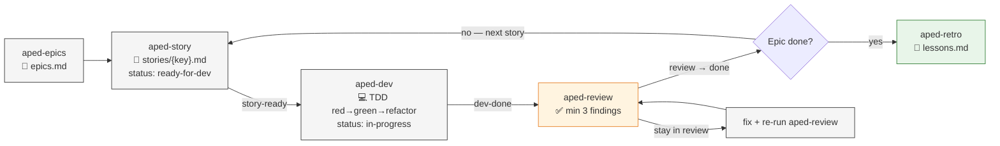
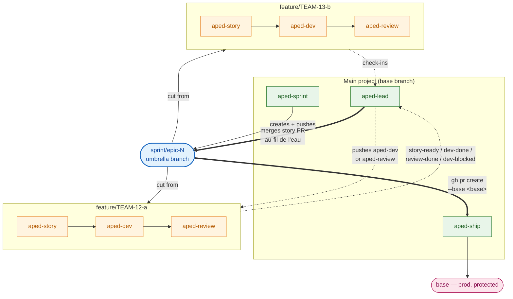

---
tags: [aped, workflow, process]
---

# APED — Workflow
**APED** (Analyze → PRD → UX → Arch → Epics → Story → Dev → Review) is a disciplined dev pipeline for [Claude Code](https://claude.ai/download). Every phase produces an **artifact**, requires **explicit user validation**, and hands off via a **coherence hook** that warns on skipped steps.

> 📦 Product: `npx aped-method` — scaffolds **25 skills** + hooks into any Claude Code project. Latest stable: **v4.0.0** (2026-04-29).
> 🔗 See also: [APED — Phases](.aped-phases.md), [APED — Personas & Teams](.aped-personas.md), [APED — Team Quickstart](.aped-quickstart.md)

> ℹ️ **Slash commands removed in 4.0.0** — the 3.x `/aped-X` shells (scaffolded as `.claude/commands/aped-*.md`) were retired. Skills are the only invocation surface — use the **Skill tool** directly or rely on **natural-language triggers** that match each skill's `description:` (say *"create the prd"*, *"run an architecture review"*, etc.).

---

## Main pipeline

Nominal flow, from idea to shipping:

```mermaid
flowchart LR
    B["aped-brainstorm<br/>(optional)"] -.-> A
    P["aped-prfaq<br/>(optional)"] -.-> A
    A["aped-analyze<br/>📄 product-brief.md"] --> PRD["aped-prd<br/>📄 prd.md"]
    PRD --> UX["aped-ux<br/>📄 ux/ + preview app"]
    UX --> ARCH["aped-arch<br/>📄 architecture.md"]
    ARCH --> EP["aped-epics<br/>📄 epics.md + tickets"]
    EP --> ST["aped-story<br/>📄 stories/{key}.md"]
    ST --> DEV["aped-dev<br/>💻 code + tests (TDD)"]
    DEV --> RV["aped-review<br/>✅ verdict done/return"]
    RV -->|done| NEXT["Next story<br/>or aped-ship"]
    RV -->|return| RR["aped-receive-review<br/>(since 3.11.0)"]
    RR --> DEV

    classDef upstream fill:#e8f0ff,stroke:#4a90e2
    classDef phase fill:#f5f5f5,stroke:#333
    classDef gate fill:#fff4e0,stroke:#e67e22
    classDef discipline fill:#fde8e8,stroke:#c0392b
    class B,P upstream
    class A,PRD,UX,ARCH,EP,ST,DEV phase
    class RV gate
    class RR discipline
```



**Key rules**
- ⏸ **No auto-chaining** between phases — every skill ends with "Run `aped-X` when ready"
- 🚪 **Gates (⏸)** mark every write / state change requiring your approval
- 🎯 **The Linear/Jira/GitHub ticket is the source of truth** shared between the AI and the human team
- 🔒 **Upstream-lock hook**: denies any edit to `prd.md` / `architecture.md` / `ux/` while a story is in-progress (only `aped-course` can unlock)
- 🛡️ **Spec-reviewer dispatch** (since 3.12.0) — `aped-prd`, `aped-ux`, `aped-epics`, `aped-analyze`, `aped-brainstorm` each dispatch an adversarial subagent before the user gate that validates the produced artefact for completeness / consistency / clarity / scope / YAGNI. Calibrated per artefact type. NACK behaviour: HALT → `[F]ix → revise + redispatch once` / `[O]verride → proceed with reason recorded`.
- 🔍 **Skill-first invocation** (since 3.12.0) — primary invocation is via the Skill tool or natural language matching the skill `description:` triggers. The CLAUDE.md template now ships a "Skill Invocation Discipline" section with the **1% rule** (*"if there's even a 1% chance a skill applies, invoke it"*) and a 12-row rationalization table.

---

## Sequential dev loop (default mode)

Without sprint mode, you run the implementation phases one story at a time — no worktrees, no umbrella branch, no `aped-lead`. State.yaml is written directly in main; the loop is entirely user-paced.



**Per story:**

1. **`aped-story [story-key]`** — picks the next `pending` story, re-fetches the ticket (source of truth), drafts the story file with full context compilation (PRD / arch / UX / project-context / lessons / previous stories of the epic), HALTs on the A/P/C menu before writing. Output: `docs/aped/stories/{story-key}.md`, status flipped to `ready-for-dev`.
2. **`aped-dev [story-key]`** — re-fetches the ticket, runs the TDD red → green → refactor cycle one task at a time, visual check via React Grab MCP on every frontend GREEN pass, status `in-progress` while running. **Blocker-halt gate** (since 3.11.0): explicit STOP conditions (missing dep / test fail / unclear instruction / repeated verification fail / never start on main without consent). Lessons scoped `aped-dev | all` are added to the Pre-Implementation Checklist.
3. **`aped-review [story-key]`** — re-fetches the ticket, dispatches always-on specialists (Eva / Marcus / Rex) + conditionals based on touched layers, minimum 3 findings. **Two-stage review** (since 3.11.0): Eva runs first as a blocking gate; Marcus + Rex + conditionals dispatched only after Eva PASS or `[O]verride`. **Marcus testing-anti-patterns checklist** (since 3.11.0): 5 patterns + gate functions to catch mock-as-test fraud. Lessons scoped `aped-review | all` augment specialists' criteria.
4. **`aped-receive-review`** (since 3.11.0) — when review finds issues, runs the dev-side discipline: forbidden performative responses ("you're absolutely right!"), 6-step Response Pattern (READ → UNDERSTAND → VERIFY → EVALUATE → RESPOND → IMPLEMENT), YAGNI grep gate on "implement properly" suggestions, multi-item clarification gate (HALT before implementing partial feedback).
5. **Loop**: pick the next story with `aped-story`, or close the epic with `aped-retro` once the last one is `done`.

**Same guarantees as sprint mode** — HALT at every load-bearing gate, ticket as source of truth, `upstream-lock` hook, lessons feedback loop, sync-logs on ticket-touching ops.

---

## Parallel sprint mode (optional)

Once `aped-epics` is done, multiple stories can run in parallel via `git worktree`. Two-tier architecture: **Lead Dev** (you, in the main project) ↔ **Story Leaders** (Claude sessions inside each worktree). Since v3.10.0 the sprint integrates via a **sprint umbrella branch** (`sprint/epic-{N}`) so production teams with branch protection on the base branch can ship safely.



**Roles in one line each**
- `aped-sprint` — creates the umbrella branch + dispatches stories. Emits a sync-log on any ticket-touching op.
- `aped-lead` — approves check-ins, pushes the next command, merges each story PR into the umbrella au-fil-de-l'eau on `review-done`. **Status protocol** (since 3.11.0): `--status DONE | DONE_WITH_CONCERNS | NEEDS_CONTEXT | BLOCKED` — only `DONE` runs auto-approve; the other three escalate with priority hints.
- `aped-ship` — opens the final umbrella → base PR with the composite review attached. Emits a sync-log per ticket close.

**Default limits**: `parallel_limit: 3`, `review_limit: 2`. Check-ins (4 kinds): `story-ready`, `dev-done`, `review-done`, `dev-blocked`. Programmatic verdicts via `check-auto-approve.sh`. Audit log at `.aped/logs/sprint-{date}.jsonl`.

**State.yaml authority lives in main** — worktrees write divergent copies; `aped-ship` resolves with `--ours` by design.

**Dispatch** — with [workmux](https://github.com/raine/workmux) → tmux window auto-created. Without → `sprint-dispatch.sh` prints the commands.

**Dry-run** — `aped-sprint` and `aped-ship` accept `--plan-only`.

---

## Design principles

1. **User controls the pace** — no auto-chaining, each phase ends with "Run `aped-X` when ready".
2. **A/P/C menu at every load-bearing gate** — `[A]` invokes `aped-elicit` (advanced critique toolkit), `[P]` dispatches a multi-specialist sub-team, `[C]` continues. Direct user feedback always accepted as a fallback.
3. **Skill-first invocation** — primary (and, since 4.0.0, only) invocation is the Skill tool or natural language matching `description:` triggers. The CLAUDE.md template ships the **1% rule** + a 12-row rationalization table to make skill invocation reflexive.
4. **Spec-reviewer dispatch** (since 3.12.0) — adversarial subagent gate before the user gate on every artefact-producing skill (`aped-prd`, `aped-ux`, `aped-epics`, `aped-analyze`, `aped-brainstorm`). Calibrated per artefact type. Catches FR/NFR contradictions, missing ACs, ambiguous metrics, scope creep, screen/flow inconsistency, orphan FRs, depends_on cycles, weak evidence — before downstream skills burn cycles on flawed inputs.
5. **Verification-before-completion gate** (since 3.11.0) — `aped-dev` and `aped-review` enforce "NO PASS WITHOUT FRESH EVIDENCE IN THIS MESSAGE" with a forbidden-phrases list (`should work` / `looks good` / `Done!` / `probably fine` …) and 3 accepted evidence forms (captured command output, diff with test output, screenshot reference). Optional `verify-claims.js` PostToolUse hook scans Bash output for the same phrases.
6. **`aped-debug` 4-phase systematic debugging** (since 3.11.0) — Reproduce → Root-cause-trace → Fix-with-test → Verify. **3-failed-fixes rule** verbatim from Superpowers: after 3 attempts that didn't move the failure forward, STOP and question the architecture/spec, not try fix #4. Sub-disciplines: `root-cause-tracing` (backward call-stack tracing + `find-polluter.sh`), `condition-based-waiting` (`waitFor()` replacing arbitrary timeouts), `defense-in-depth` (4-layer validation: entry / business / environment / debug).
7. **Iron Law / Red Flags / Rationalizations triplet** (since 3.11.0) — phase-specific named failure modes in `aped-{prd,dev,review,story,debug,receive-review}`. Modelled on Superpowers' rhetorical pattern, grounded in Meincke 2025 persuasion research (Authority + Commitment + Scarcity → 33%→72% compliance lift).
8. **Conversational coaching, not silent generation** — `aped-brainstorm` Phase 3 surfaces ideas one at a time with explicit HALTs and three coaching patterns (basic answer → dig; detailed answer → build; stuck → seed).
9. **Headless mode** — `aped-prd --headless` and `aped-prfaq --headless` for CI / scripts. `--plan-only` on `aped-sprint` and `aped-ship`: dry-run.
10. **Binary review outcomes** — `done` (all resolved) or stay in `review`. No `[AI-Review]` limbo.
11. **Visual check first-class** — every frontend GREEN pass → `mcp__react-grab-mcp__get_element_context`.
12. **Ticket = source of truth** — divergence = HALT.
13. **Stories created one at a time** — `aped-epics` writes the plan; `aped-story` produces one story file right before implementation.
14. **Epic context cache** — `docs/aped/epic-{N}-context.md` compiled once, reused.
15. **External ticket intake** — `aped-from-ticket <ticket-id-or-url>` for tickets bypassing `aped-epics` planning.
16. **Input discovery — consume-everything-found** — every skill globs `docs/aped/**` at entry and loads upstream artefacts.
17. **Lessons feedback loop** — `aped-retro` writes scoped rules to `lessons.md`; `aped-story`, `aped-dev`, `aped-review` consume them at runtime.
18. **Sync-logs auditability** (since 3.12.0) — `aped/scripts/sync-log.sh` (start / phase / record / end) emits structured JSON audit logs at `docs/sync-logs/<provider>-sync-<ISO>.json` for every ticket-system operation. Atomic writes; concurrent calls protected by mkdir-lock with stale-recovery. Configurable per project.

---

## What gets scaffolded

A `npx aped-method` run drops:

- **`.aped/`** — update-safe engine: `config.yaml`, hooks (`guardrail.sh`, `upstream-lock.sh`), scripts (sync-state, sync-log, validate-state, migrate-state, check-auto-approve, check-active-worktrees, log, find-polluter, lint-placeholders), templates, **25 sub-skills** including the new `aped-debug/`, `aped-receive-review/`.
- **`.aped/aped-skills/`** (since 3.11.0) — reference docs callable on demand: `anthropic-best-practices.md` (CSO description principle, gerund naming, no-placeholders), `persuasion-principles.md` (7-principle table, Meincke 2025 attribution), `testing-skills-with-subagents.md` (RED-GREEN-REFACTOR runner methodology — wakes up the skill-triggering harness).
- **`.claude/skills/aped-*`** — symlinks back to `.aped/aped-*/` so Claude Code's standard skill discovery picks every APED skill up. The 3.x slash-command shells under `.claude/commands/` were removed in 4.0.0.
- **`.claude/settings.local.json`** — UserPromptSubmit + PreToolUse hooks + pre-approved Bash permissions.
- **`docs/aped/`** — evolving output: `state.yaml` (now with `schema_version: 1` + optional top-level slots `ticket_sync` / `backlog_future_scope` / `corrections` since 3.12.0; richer per-phase records under `pipeline.phases.<phase>`), `product-brief.md`, `prd.md`, `ux/`, `architecture.md`, `epics.md`, `stories/`, `retros/`, `lessons.md`, `epic-{N}-context.md`.
- **`docs/sync-logs/`** (since 3.12.0) — structured JSON audit logs `<provider>-sync-<ISO>.json` emitted by `aped-epics`, `aped-from-ticket`, `aped-ship`, `aped-course`. Configurable: `sync_logs.{enabled, dir}` in `config.yaml`.
- **Cross-tool symlinks** (auto-detected): `.claude/skills/`, `.opencode/skills/`, `.agents/skills/`, `.codex/skills/` → `.aped/aped-*`.

### Optional opt-in add-ons

```bash
aped-method doctor                # verify scaffold, hooks, state, skills, symlinks
aped-method statusline            # APED-aware status line
aped-method safe-bash             # Bash safety hook
aped-method symlink               # repair APED skill symlinks
aped-method post-edit-typescript  # TS post-edit quality hook
aped-method verify-claims         # PostToolUse advisory hook (since 3.11.0) — scans Bash output for forbidden completion phrases without evidence
aped-method session-start         # SessionStart skill-index hook (since 3.11.0) — injects aped/skills/SKILL-INDEX.md as additionalContext at session boot
aped-method visual-companion      # bash + python3 HTTP server (since 3.11.0) for aped-brainstorm browser-based mockup/diagram rendering (default port 3737)
```

Each opt-in subcommand also accepts `--uninstall`.

---

## Integrations

| Ticket system | PR provider | Commit format | Sync-log provider tag |
|---|---|---|---|
| Linear (CLI / API) | GitHub (`gh`) | `feat(TEAM-XX): …` | `linear` |
| Jira (curl) | GitLab (`glab`) | `feat(PROJ-XX): …` | `jira` |
| GitHub Issues (`gh`) | Bitbucket (Web UI) | `feat(#XX): …` | `github` |
| GitLab Issues (`glab`) | | `feat(#XX): …` | `gitlab` |
| `none` (JSONL fallback) | | `feat: …` | n/a (no sync-log emitted) |

---

## Resources

- 📚 Skill source: `src/templates/skills/aped-*.md` in [the source repo](https://github.com/yabafre/aped-claude/tree/main/packages/create-aped/src/templates/skills) — every skill carries its own `description:`, triggers, and inline cheat sheet.
- 🆘 Troubleshooting: [`docs/TROUBLESHOOTING.md`](https://github.com/yabafre/aped-claude/blob/main/packages/create-aped/docs/TROUBLESHOOTING.md)
- 📦 npm: [`aped-method`](https://www.npmjs.com/package/aped-method) — latest **4.0.0** with provenance attestation.
- 💻 Source: [github.com/yabafre/aped-claude](https://github.com/yabafre/aped-claude)


---

